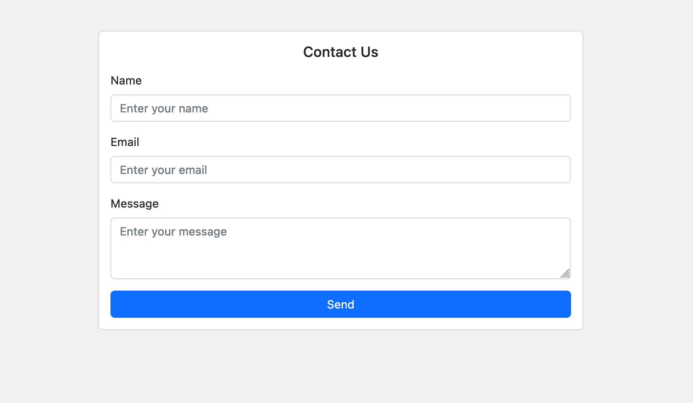

# Problem Solving Competitions - Web ( 27th Dec 2022 - 3rd Jan 2023 )

## About

In this challenge, you're going to build a workable contact form. 

## The Challenge

Your challenge is to build a contact form that meets the following requirements:

- Use the code here as a starting point: https://github.com/forwardschool/bew1.1_contact_form
- The form should be able to detect if any of the fields are empty and display an error message if so.
- The form should be able to detect if the email address is invalid and display an error message if so.
- The form should be able to detect if the message is less than 10 characters and display an error message if so.
- Once the form is submitted, it should display a success message.
- Save the form data into a database.
- You should only insert your code in the area specified with the comment `// Only change code below this line` and `// Only change code above this line`. Do not change any other code.
- (Bonus point) Upon submission, send an email to the admin (can be your own email, or any fake email) with the form data via SMTP API (postmark, mailgun, etc.)
